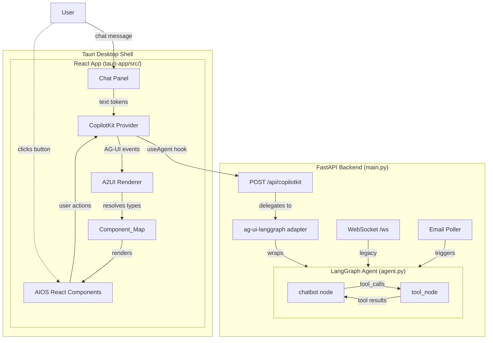
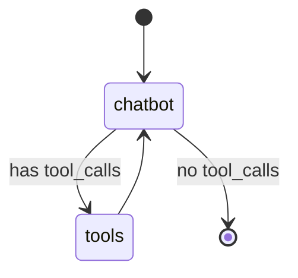

# Design Document: Declarative UI Generation (React + CopilotKit + AG-UI)

## Overview

This design replaces the Astra Agent's HTML-generating pipeline with a modern React + CopilotKit + AG-UI architecture. The previous approach (abandoned) used a Python-side `AIOSRenderer` that converted A2UI messages to HTML strings, delivered via WebSocket to iframes in a GridStack layout. The new approach eliminates server-side rendering entirely.

The current agent prompt (`system.md` + `design_system.md` + `widget_templates.md` + `persona_context.md`) includes ~4000+ tokens of HTML templates, CSS rules, and widget layout instructions. The agent generates raw HTML via the `render_widget` tool, coupling business logic to presentation. The new architecture cleanly separates these concerns across three layers:

1. **Agent Layer** — The LangGraph agent (`agent.py`) emits structured A2UI JSON messages via a new `emit_ui` tool. The system prompt contains only the A2UI format spec and a concise component catalog (type names + props schemas). No HTML, CSS, or JS.
2. **Transport Layer** — The `ag-ui-langgraph` Python package wraps the existing compiled LangGraph graph and exposes it as an AG-UI compatible SSE endpoint (`POST /api/copilotkit`). This replaces the custom WebSocket transport for the new frontend.
3. **Frontend Layer** — A React app inside `tauri-app/` uses CopilotKit's `<CopilotKit>` provider, `useAgent` hook, and A2UI renderer to receive agent events and render custom AIOS-themed React components. No iframes, no GridStack, no server-side HTML generation.

### Key Benefits

- **Token reduction**: Removes ~4000 tokens of HTML/CSS from agent context, replaced by ~800 tokens of A2UI format spec + component catalog.
- **Separation of concerns**: Agent reasons about WHAT to show; React components decide HOW to render.
- **No server-side rendering**: The `a2ui_renderer.py` module is eliminated. All rendering happens in the React frontend.
- **Standard protocol**: AG-UI is CopilotKit's open-source streaming protocol — no custom WebSocket message types needed for the new frontend.
- **Richer interactivity**: React components can manage local state (tabs, hover, animations) without agent round-trips.
- **Testability**: A2UI messages are structured data — easy to validate, round-trip test, and snapshot.

### Phase 1 MVP Scope

- All component values use literal props (no reactive data binding)
- No incremental `surfaceUpdate` merging — each `emit_ui` call is a complete surface definition
- `deleteSurface` support in React app
- `render_widget` tool and WebSocket `/ws` endpoint kept for backward compatibility
- Email poller continues to work — triggers agent, AG-UI delivers A2UI to connected React frontends

## Architecture



### LangGraph Graph — No Changes

The existing graph structure is preserved. No `ui_renderer` node is needed because there is no server-side rendering.



The `emit_ui` tool is a passthrough — it returns a confirmation string to the agent. The AG-UI transport automatically includes the tool call arguments (A2UI JSON) in the streamed events, and CopilotKit processes them on the frontend.

### Data Flow (Phase 1)

1. Agent decides to show UI → calls `emit_ui` tool with `surface_id`, `components` (adjacency list), and optional `grid` hints
2. `tool_node` executes `emit_ui` → returns confirmation string to agent
3. `ag-ui-langgraph` adapter streams the tool call event (including A2UI JSON arguments) as an AG-UI event over SSE
4. CopilotKit's `useAgent` hook receives the event
5. CopilotKit's A2UI renderer processes `surfaceUpdate` + `beginRendering` messages
6. Component_Map resolves A2UI type names to AIOS-themed React components
7. React components render in the dashboard area with AIOS design system styling
8. Interactive components (Button, Tabs) send actions back through CopilotKit's agent communication channel

### Email Poller Integration

The email poller (`_email_poller()` in `main.py`) currently pushes messages through WebSocket connections. With the new architecture:

- The poller triggers the agent with a `HumanMessage` (unchanged)
- The agent calls `emit_ui` (instead of `render_widget`) to emit stock alerts
- The AG-UI adapter streams the events to connected CopilotKit frontends via SSE
- During migration, the poller continues to work with WebSocket connections for the legacy frontend


## Components and Interfaces

### 1. `emit_ui` Tool (agent.py)

A new LangChain tool that the agent calls instead of `render_widget`. It is a passthrough — returns a confirmation string. The AG-UI transport carries the tool call arguments to the frontend.

```python
@tool
def emit_ui(surface_id: str, components: list[dict], grid: dict | None = None) -> str:
    """Emit a declarative UI surface using A2UI components.

    Args:
        surface_id: Unique identifier for this surface (e.g., "stock-alert", "mike-dashboard").
        components: Flat list of A2UI components in adjacency list format.
            Each component: {"id": str, "type": str, "props": dict, "children": list[str]}
            The first component is the root unless a separate beginRendering specifies otherwise.
        grid: Optional layout hints {"w": int (1-12 columns), "h": int (row units)}.

    Returns:
        Confirmation string: "Surface {surface_id} emitted with {N} components."
    """
    return f"Surface {surface_id} emitted with {len(components)} components."
```

The tool is added to the `tools` list in `agent.py` alongside the existing tools. The `render_widget` tool is retained for backward compatibility but the agent prompt instructs the agent to prefer `emit_ui`.

### 2. A2UI Message Models (a2ui_models.py — Already Created)

The existing Pydantic models are retained unchanged:

```python
class A2UIComponent(BaseModel):
    id: str
    type: str  # "Text", "Button", "Card", "Row", "Column", "StockTicker", etc.
    props: dict[str, Any] = {}
    children: list[str] = []  # Child component IDs (adjacency list)

class SurfaceUpdate(BaseModel):
    message_type: Literal["surfaceUpdate"] = "surfaceUpdate"
    surface_id: str
    components: list[A2UIComponent]

class BeginRendering(BaseModel):
    message_type: Literal["beginRendering"] = "beginRendering"
    surface_id: str
    root: str  # Root component ID

class DeleteSurface(BaseModel):
    message_type: Literal["deleteSurface"] = "deleteSurface"
    surface_id: str

class DataModelUpdate(BaseModel):  # Phase 2 stub
    message_type: Literal["dataModelUpdate"] = "dataModelUpdate"
    surface_id: str
    contents: list[dict] = []

A2UIMessage = Union[SurfaceUpdate, BeginRendering, DeleteSurface, DataModelUpdate]
```

### 3. AG-UI SSE Endpoint (main.py)

A new FastAPI route that delegates to the `ag-ui-langgraph` adapter:

```python
from ag_ui_langgraph import create_adapter

# Create AG-UI adapter wrapping the existing compiled graph
agui_adapter = create_adapter(graph)

@app.post("/api/copilotkit")
async def copilotkit_endpoint(request: Request):
    """AG-UI SSE endpoint for CopilotKit frontend."""
    return await agui_adapter.handle(request)
```

The adapter handles:
- AG-UI protocol request parsing
- Streaming LangGraph events as AG-UI events (text tokens, tool calls, lifecycle signals)
- Session management via AG-UI's `threadId` parameter (maps to LangGraph's `thread_id`)
- A2UI messages are carried as tool call arguments in the AG-UI event stream

The existing WebSocket `/ws` endpoint, health check `/health`, and POST `/chat` are all preserved.

### 4. CopilotKit React Provider (tauri-app/src/App.tsx)

The root React component wraps the app with CopilotKit's provider:

```tsx
import { CopilotKit } from "@copilotkit/react-core";
import { useAgent } from "@copilotkit/react-core";
import { Dashboard } from "./components/Dashboard";
import { ChatPanel } from "./components/ChatPanel";

function App() {
  return (
    <CopilotKit
      runtimeUrl="http://localhost:7100/api/copilotkit"
    >
      <div className="aios-layout">
        <Dashboard />
        <ChatPanel />
      </div>
    </CopilotKit>
  );
}
```

### 5. Component_Map (tauri-app/src/components/componentMap.ts)

A registry mapping A2UI type names to React component implementations:

```tsx
import { AIOSText, AIOSButton, AIOSCard, AIOSRow, AIOSColumn,
         AIOSDivider, AIOSTabs, AIOSImage, AIOSIcon, AIOSList,
         AIOSStockTicker, AIOSStockAlert, AIOSEmailRow,
         AIOSMetricCard, AIOSSparklineChart, AIOSCalendarEvent,
         AIOSFallback } from "./aios";

export const componentMap: Record<string, React.ComponentType<any>> = {
  // Standard catalog
  Text: AIOSText,
  Button: AIOSButton,
  Card: AIOSCard,
  Row: AIOSRow,
  Column: AIOSColumn,
  Divider: AIOSDivider,
  Tabs: AIOSTabs,
  Image: AIOSImage,
  Icon: AIOSIcon,
  List: AIOSList,
  // Custom Astra components
  StockTicker: AIOSStockTicker,
  StockAlert: AIOSStockAlert,
  EmailRow: AIOSEmailRow,
  MetricCard: AIOSMetricCard,
  SparklineChart: AIOSSparklineChart,
  CalendarEvent: AIOSCalendarEvent,
};

// Fallback for unrecognized types
export const fallbackComponent = AIOSFallback;
```

### 6. AIOS-Themed React Components (tauri-app/src/components/aios/)

Each component receives A2UI `props` and renders with AIOS design system styling. Layout components receive resolved `children` as React elements.

**Standard Components:**

```tsx
// AIOSCard.tsx — glassmorphic card container
export function AIOSCard({ children, padding = "16px", variant = "glass" }: AIOSCardProps) {
  return (
    <div className={`aios-card aios-card--${variant}`} style={{ padding }}>
      {children}
    </div>
  );
}

// AIOSButton.tsx — interactive button with event bridge
export function AIOSButton({ label, action, payload, variant = "primary", onAction }: AIOSButtonProps) {
  return (
    <button
      className={`aios-btn aios-btn--${variant}`}
      onClick={() => onAction?.(action, payload)}
    >
      {label}
    </button>
  );
}

// AIOSText.tsx — text with variant styling
export function AIOSText({ text, variant = "body", weight = "normal" }: AIOSTextProps) {
  return (
    <span className={`aios-text aios-text--${variant}`} style={{ fontWeight: weight }}>
      {text}
    </span>
  );
}
```

**Custom Astra Components:**

```tsx
// AIOSStockTicker.tsx
export function AIOSStockTicker({ ticker, company, price, change_pct, onAction }: StockTickerProps) {
  const isPositive = change_pct >= 0;
  return (
    <div className="aios-stock-ticker" onClick={() => onAction?.("stock_clicked", { ticker })}>
      <span className="ticker-symbol">{ticker}</span>
      <span className="ticker-company">{company}</span>
      <span className="ticker-price">${price.toFixed(2)}</span>
      <span className={`ticker-change ${isPositive ? "positive" : "negative"}`}>
        {isPositive ? "+" : ""}{change_pct.toFixed(2)}%
      </span>
    </div>
  );
}

// AIOSFallback.tsx — renders unknown types as Card with JSON
export function AIOSFallback({ type, props, children }: FallbackProps) {
  return (
    <div className="aios-card aios-card--outlined">
      <span className="aios-text aios-text--muted">Unknown component: {type}</span>
      <pre className="aios-fallback-json">{JSON.stringify(props, null, 2)}</pre>
      {children}
    </div>
  );
}
```

### 7. AIOS Design System (tauri-app/src/theme/)

CSS custom properties and base styles applied globally:

```css
/* tauri-app/src/theme/aios.css */
:root {
  --bg-panel: rgba(15, 23, 42, 0.95);
  --bg-card: rgba(30, 41, 59, 0.7);
  --bg-card-hover: rgba(30, 41, 59, 0.9);
  --accent-blue: #3b82f6;
  --accent-cyan: #06b6d4;
  --accent-green: #22c55e;
  --accent-red: #ef4444;
  --accent-amber: #f59e0b;
  --text-primary: #f8fafc;
  --text-secondary: #94a3b8;
  --text-muted: #64748b;
  --border-subtle: rgba(148, 163, 184, 0.1);
  --glass-blur: 12px;
  --radius-md: 12px;
  --radius-lg: 16px;
  --font-family: 'Inter', system-ui, -apple-system, sans-serif;
  --transition-fast: 150ms ease;
}

.aios-card--glass {
  background: var(--bg-card);
  backdrop-filter: blur(var(--glass-blur));
  border: 1px solid var(--border-subtle);
  border-radius: var(--radius-lg);
  transition: background var(--transition-fast);
}

.aios-card--glass:hover {
  background: var(--bg-card-hover);
}
```

### 8. Agent Prompt Restructuring

**Removed from agent context:**
- `design_system.md` (~500 tokens of CSS rules)
- `widget_templates.md` (~3000 tokens of HTML templates)

**Added to agent context:**
- `prompts/a2ui_catalog.md` (~800 tokens) — A2UI format spec + component catalog

**Modified:**
- `prompts/system.md` — References `emit_ui` instead of `render_widget`, no HTML/CSS/JS instructions

**Kept unchanged:**
- `prompts/persona_context.md` — Persona context (updated to reference `emit_ui` instead of `render_widget` in dashboard guidelines)

**New prompt composition in `agent.py`:**

```python
SYSTEM_PROMPT = (
    load_prompt("system") + "\n\n" +
    load_prompt("a2ui_catalog") + "\n\n" +
    load_prompt("persona_context")
)
```

### 9. Component Catalog Prompt (prompts/a2ui_catalog.md)

A concise prompt file listing:
- A2UI adjacency list format specification with one complete example
- Standard catalog: Text, Button, Card, Row, Column, Divider, Tabs, Image, Icon, List — each with type name and props schema
- Custom Astra catalog: StockTicker, StockAlert, EmailRow, MetricCard, SparklineChart, CalendarEvent — each with type name and props schema
- Instructions: emit `surfaceUpdate` then `beginRendering`, use descriptive IDs, reference children by ID

### 10. Dashboard Layout (tauri-app/src/components/Dashboard.tsx)

The dashboard area renders agent-generated surfaces:

```tsx
export function Dashboard() {
  // CopilotKit's A2UI renderer manages surfaces internally
  // Each surface_id maps to a rendered section
  return (
    <div className="aios-dashboard">
      {/* A2UI renderer places surfaces here */}
      <A2UIRenderer componentMap={componentMap} fallback={AIOSFallback} />
    </div>
  );
}
```

### 11. Chat Panel (tauri-app/src/components/ChatPanel.tsx)

The chat panel displays streamed text tokens and provides user input:

```tsx
export function ChatPanel() {
  const { messages, sendMessage, isLoading } = useAgent();

  return (
    <div className="aios-chat-panel">
      <div className="chat-messages">
        {messages.map((msg, i) => (
          <div key={i} className={`chat-message chat-message--${msg.role}`}>
            {msg.content}
          </div>
        ))}
        {isLoading && <div className="typing-indicator">...</div>}
      </div>
      <ChatInput onSend={sendMessage} disabled={isLoading} />
    </div>
  );
}
```

### 12. Updated start-dev.sh

The script is updated to start the React dev server alongside Docker and Tauri:

```bash
#!/bin/bash
set -e

echo "[Astra] Starting Docker container..."
# ... existing Docker startup (port mapping changes: backend on 8000 internally, exposed on 7101) ...

echo "[Astra] Starting React dev server..."
cd tauri-app
npm run dev &  # Vite dev server on port 7100
REACT_PID=$!

echo "[Astra] Waiting for React dev server..."
for i in {1..30}; do
    if curl -s http://localhost:7100 > /dev/null 2>&1; then
        echo "[Astra] React dev server is ready!"
        break
    fi
    sleep 1
done

echo "[Astra] Starting Tauri..."
cargo tauri dev

# Cleanup
kill $REACT_PID 2>/dev/null || true
```

The Docker container now exposes the backend on port 7101 (not 7100), since port 7100 is used by the Vite dev server. The React app proxies `/api/copilotkit` requests to `http://localhost:7101`.


## Data Models

### A2UI Component Props (by type)

**Standard Components:**

| Type | Props | Children |
|------|-------|----------|
| `Text` | `text: str`, `variant: "title"\|"body"\|"secondary"\|"muted"`, `weight: "bold"\|"semibold"\|"normal"` | — |
| `Button` | `label: str`, `action: str`, `payload: dict`, `variant: "primary"\|"secondary"\|"ghost"` | — |
| `Card` | `padding: str`, `variant: "glass"\|"flat"\|"outlined"` | Yes |
| `Row` | `gap: str`, `align: "start"\|"center"\|"end"\|"stretch"`, `wrap: bool` | Yes |
| `Column` | `gap: str`, `align: "start"\|"center"\|"end"\|"stretch"` | Yes |
| `Divider` | `spacing: str` | — |
| `Tabs` | `labels: list[str]`, `active: int` | Yes (one per tab) |
| `Image` | `src: str`, `alt: str`, `width: str`, `height: str` | — |
| `Icon` | `name: str`, `size: str`, `color: str` | — |
| `List` | `ordered: bool` | Yes |

**Custom Astra Components:**

| Type | Props |
|------|-------|
| `StockTicker` | `ticker: str`, `company: str`, `price: float`, `change_pct: float`, `action: "stock_clicked"` |
| `StockAlert` | `title: str`, `source: str`, `sentiment: "bullish"\|"bearish"\|"neutral"`, `tickers: list[dict]`, `actions: list[dict]` |
| `EmailRow` | `email_id: str`, `from_name: str`, `initial: str`, `subject: str`, `preview: str`, `time: str`, `actions: list[dict]` |
| `MetricCard` | `label: str`, `value: str`, `change: str`, `color: str`, `action: str`, `payload: dict` |
| `SparklineChart` | `values: list[float]`, `color: "green"\|"red"\|"blue"\|"cyan"`, `height: str` |
| `CalendarEvent` | `time: str`, `title: str`, `location: str`, `attendees: list[str]` |

### React Component Props Interfaces

```typescript
// Standard component props
interface AIOSTextProps {
  text: string;
  variant?: "title" | "body" | "secondary" | "muted";
  weight?: "bold" | "semibold" | "normal";
}

interface AIOSButtonProps {
  label: string;
  action: string;
  payload?: Record<string, any>;
  variant?: "primary" | "secondary" | "ghost";
  onAction?: (action: string, payload?: Record<string, any>) => void;
}

interface AIOSCardProps {
  children?: React.ReactNode;
  padding?: string;
  variant?: "glass" | "flat" | "outlined";
}

interface AIOSRowProps {
  children?: React.ReactNode;
  gap?: string;
  align?: "start" | "center" | "end" | "stretch";
  wrap?: boolean;
}

interface AIOSColumnProps {
  children?: React.ReactNode;
  gap?: string;
  align?: "start" | "center" | "end" | "stretch";
}

interface AIOSTabsProps {
  labels: string[];
  active?: number;
  children?: React.ReactNode[];
  onTabChange?: (index: number) => void;
}

// Custom Astra component props
interface StockTickerProps {
  ticker: string;
  company: string;
  price: number;
  change_pct: number;
  onAction?: (action: string, payload?: Record<string, any>) => void;
}

interface StockAlertProps {
  title: string;
  source: string;
  sentiment: "bullish" | "bearish" | "neutral";
  tickers: Array<{ ticker: string; price: number; change_pct: number }>;
  actions: Array<{ label: string; action: string; payload?: Record<string, any> }>;
  onAction?: (action: string, payload?: Record<string, any>) => void;
}

interface EmailRowProps {
  email_id: string;
  from_name: string;
  initial: string;
  subject: string;
  preview: string;
  time: string;
  actions: Array<{ label: string; action: string }>;
  onAction?: (action: string, payload?: Record<string, any>) => void;
}

interface MetricCardProps {
  label: string;
  value: string;
  change?: string;
  color?: string;
  action?: string;
  payload?: Record<string, any>;
  onAction?: (action: string, payload?: Record<string, any>) => void;
}

interface SparklineChartProps {
  values: number[];
  color?: "green" | "red" | "blue" | "cyan";
  height?: string;
}

interface CalendarEventProps {
  time: string;
  title: string;
  location?: string;
  attendees?: string[];
}

interface FallbackProps {
  type: string;
  props: Record<string, any>;
  children?: React.ReactNode;
}
```

### File Changes Summary

| File | Change |
|------|--------|
| `agent.py` | Add `emit_ui` tool, update `SYSTEM_PROMPT` composition (use `a2ui_catalog.md` instead of `design_system.md` + `widget_templates.md`) |
| `main.py` | Add `POST /api/copilotkit` SSE endpoint using `ag-ui-langgraph` adapter, keep existing WebSocket `/ws` |
| `requirements.txt` | Add `ag-ui-langgraph` dependency |
| `prompts/system.md` | Remove HTML/CSS/JS instructions, reference `emit_ui` tool |
| `prompts/a2ui_catalog.md` | **New** — A2UI format spec + component catalog for agent prompt |
| `prompts/persona_context.md` | Update dashboard guidelines to reference `emit_ui` instead of `render_widget` |
| `a2ui_models.py` | **Unchanged** — Pydantic models already created |
| `a2ui_renderer.py` | **Deleted** — No server-side rendering needed |
| `models.py` | **Unchanged** — WebSocket message types kept for backward compat |
| `tauri-app/package.json` | **New** — React + Vite + CopilotKit + Tailwind dependencies |
| `tauri-app/vite.config.ts` | **New** — Vite config (port 7100, proxy `/api` to backend) |
| `tauri-app/tsconfig.json` | **New** — TypeScript config |
| `tauri-app/index.html` | **New** — Vite entry HTML |
| `tauri-app/src/App.tsx` | **New** — Root component with CopilotKit provider |
| `tauri-app/src/main.tsx` | **New** — React entry point |
| `tauri-app/src/components/Dashboard.tsx` | **New** — Dashboard area with A2UI renderer |
| `tauri-app/src/components/ChatPanel.tsx` | **New** — Chat interface |
| `tauri-app/src/components/componentMap.ts` | **New** — A2UI type → React component registry |
| `tauri-app/src/components/aios/` | **New** — All AIOS-themed React components |
| `tauri-app/src/theme/aios.css` | **New** — AIOS design system CSS custom properties |
| `tauri-app/start-dev.sh` | **Modified** — Start React dev server + Docker + Tauri |
| `tauri-app/src-tauri/tauri.conf.json` | **Unchanged** — Already configured for `devUrl: http://localhost:7100` |
| `docker-compose.yml` | **Modified** — Change port mapping from `7100:8000` to `7101:8000` |


## Correctness Properties

*A property is a characteristic or behavior that should hold true across all valid executions of a system — essentially, a formal statement about what the system should do. Properties serve as the bridge between human-readable specifications and machine-verifiable correctness guarantees.*

### Property 1: A2UI Message Serialization Round-Trip

*For any* valid A2UI message (SurfaceUpdate, BeginRendering, DeleteSurface) — including those with Unicode text in component props, numeric values, boolean flags, and null/optional fields — serializing to JSON and then deserializing SHALL produce an object equivalent to the original.

**Validates: Requirements 11.1, 11.2, 11.3**

### Property 2: Adjacency List Structural Invariant

*For any* SurfaceUpdate message, the `components` array SHALL be a flat list where every entry has a string `id`, a string `type`, a dict `props`, and a `children` list containing only string IDs. No entry in `children` shall be a nested component object — only string references to other component IDs in the same list.

**Validates: Requirements 2.1, 2.2**

### Property 3: Agent Prompt Contains No HTML/CSS/JS

*For any* version of the restructured agent system prompt (composed from `system.md` + `a2ui_catalog.md` + `persona_context.md`), the prompt string SHALL NOT contain any HTML tags (e.g., `<div>`, `<style>`, `<script>`), CSS property declarations (e.g., `background:`, `border-radius:`, `backdrop-filter:`), or inline JavaScript code (e.g., `function(`, `=>`, `document.getElementById`).

**Validates: Requirements 6.2, 7.3**

### Property 4: Component_Map Covers All A2UI Catalog Types

*For any* A2UI component type in the catalog (standard types: Text, Button, Card, Row, Column, Divider, Tabs, Image, Icon, List; custom types: StockTicker, StockAlert, EmailRow, MetricCard, SparklineChart, CalendarEvent), the Component_Map SHALL contain a corresponding non-null React component entry.

**Validates: Requirements 4.4, 5.1, 5.2, 10.1, 10.2, 10.3, 10.4, 10.5, 10.6**

### Property 5: emit_ui Tool Is a Passthrough

*For any* valid `surface_id` string and `components` list (of any length including empty), calling the `emit_ui` tool SHALL return a confirmation string containing the `surface_id` and the component count, without modifying any external state or raising exceptions.

**Validates: Requirements 6.1, 8.3**

### Property 6: DeleteSurface Removes Surface from State

*For any* set of rendered surfaces in the React app state, processing a `deleteSurface` message with a given `surface_id` SHALL result in that surface no longer being present in the rendered surfaces state, while all other surfaces remain unchanged.

**Validates: Requirements 4.5**

### Property 7: Fallback Component Renders for Unknown Types

*For any* A2UI component with a `type` string that is not in the Component_Map, the rendering pipeline SHALL use the fallback component, which displays the component type name and the raw props as formatted JSON.

**Validates: Requirements 5.4**

### Property 8: Button Component Emits Action on Click

*For any* AIOSButton component with an `action` string and optional `payload` dict, triggering the click handler SHALL invoke the `onAction` callback with the exact `action` string and `payload` values that were passed as props.

**Validates: Requirements 5.5**

### Property 9: Tabs Component Manages State and Emits Event

*For any* AIOSTabs component with N tab labels (N ≥ 1) and any valid tab index i (0 ≤ i < N), selecting tab i SHALL update the locally displayed active tab to i and invoke the `onTabChange` callback with the value i.

**Validates: Requirements 5.6**


## Error Handling

### Transport Errors (SSE Endpoint)

- **AG-UI adapter initialization failure**: If `ag-ui-langgraph` fails to create the adapter (e.g., incompatible graph structure), the FastAPI app logs the error at startup and the `/api/copilotkit` route returns HTTP 500 with a descriptive error message. The WebSocket `/ws` endpoint continues to function as fallback.
- **SSE stream error during agent execution**: If the LangGraph agent raises an exception mid-stream, the AG-UI adapter emits an AG-UI error event with the exception message, then closes the stream. CopilotKit on the frontend surfaces this as an error message in the chat panel.
- **Client disconnects mid-stream**: The SSE connection is closed. No cleanup needed — LangGraph's MemorySaver retains conversation state for reconnection.
- **Invalid AG-UI request**: The `ag-ui-langgraph` adapter validates incoming requests. Malformed requests receive HTTP 400 with a validation error message.

### Agent Tool Errors

- **`emit_ui` called with invalid arguments**: The `tool_node` catches validation errors and returns a `ToolMessage` with the error description to the agent, allowing it to retry. Since `emit_ui` is a passthrough, the only validation is that `surface_id` is a non-empty string and `components` is a list.
- **`emit_ui` called with malformed component data**: The tool itself doesn't validate component structure (it's a passthrough). Validation happens on the frontend when CopilotKit's A2UI renderer processes the components. Invalid components are handled by the fallback renderer.
- **`render_widget` errors (backward compat)**: Handled exactly as before — no change to existing error paths in `_handle_user_message`.

### Frontend Rendering Errors

- **Unknown component type**: The Component_Map lookup falls through to the `AIOSFallback` component, which renders a Card with the type name and raw props as formatted JSON. No crash, no silent failure.
- **Missing child ID reference**: If a layout component references a child ID that doesn't exist in the surface's component list, the A2UI renderer skips that child and renders the remaining children. A console warning is logged.
- **Component render exception**: React error boundaries around each surface catch rendering exceptions and display a fallback error card with the surface ID and error message, preventing one broken surface from crashing the entire dashboard.
- **CopilotKit connection failure**: If the SSE endpoint is unreachable, CopilotKit's `useAgent` hook surfaces a connection error. The chat panel displays a "Connecting..." state with automatic retry using exponential backoff.

### Backward Compatibility Errors

- **WebSocket and SSE running simultaneously**: Both endpoints are independent — errors in one don't affect the other. The WebSocket handler continues to use the existing error handling in `_handle_user_message`.
- **Email poller with mixed frontends**: The poller triggers the agent which may call both `emit_ui` (for React frontends via AG-UI) and `render_widget` (for legacy frontends via WebSocket). Each path has independent error handling.

## Testing Strategy

### Property-Based Testing

All correctness properties (Properties 1–9) SHALL be implemented as property-based tests. The Python-side properties (1–5) use the `hypothesis` library. The TypeScript/React-side properties (4, 6–9) use `fast-check` with React Testing Library.

Each property test SHALL:
- Run a minimum of 100 iterations (Python: `@settings(max_examples=100)`, TypeScript: `fc.assert(fc.property(...), { numRuns: 100 })`)
- Use generated random inputs (Hypothesis strategies for Python, fast-check arbitraries for TypeScript)
- Be tagged with a comment referencing the design property
- Tag format: `Feature: declarative-ui-generation, Property {N}: {title}`
- Be a single test function per property

**Python property tests (hypothesis):**

| Property | Test File | Key Generators |
|----------|-----------|----------------|
| P1: Serialization round-trip | `tests/test_a2ui_models.py` | `surface_update()`, `begin_rendering()`, `delete_surface()` — generate random A2UI messages with Unicode, numbers, booleans, nulls |
| P2: Adjacency list invariant | `tests/test_a2ui_models.py` | `surface_update()` — generate random SurfaceUpdates, validate flat structure and string-only children |
| P3: No HTML/CSS/JS in prompt | `tests/test_prompt_separation.py` | `st.just(SYSTEM_PROMPT)` — single value, but test scans for HTML tags, CSS properties, JS patterns |
| P5: emit_ui passthrough | `tests/test_emit_ui.py` | `st.text()` for surface_id, `st.lists(st.fixed_dictionaries(...))` for components |

**TypeScript property tests (fast-check + React Testing Library):**

| Property | Test File | Key Generators |
|----------|-----------|----------------|
| P4: Component_Map coverage | `tauri-app/src/__tests__/componentMap.test.ts` | `fc.constantFrom(...catalogTypes)` — enumerate all catalog types |
| P6: DeleteSurface removes surface | `tauri-app/src/__tests__/surfaceState.test.ts` | `fc.record({surfaceId: fc.string()})` — generate random surface IDs |
| P7: Fallback for unknown types | `tauri-app/src/__tests__/fallback.test.tsx` | `fc.string().filter(s => !catalogTypes.includes(s))` — generate non-catalog type strings |
| P8: Button emits action | `tauri-app/src/__tests__/AIOSButton.test.tsx` | `fc.record({action: fc.string(), payload: fc.dictionary(...)})` — generate random actions/payloads |
| P9: Tabs manages state | `tauri-app/src/__tests__/AIOSTabs.test.tsx` | `fc.nat({max: 10}).chain(n => fc.record({labels: fc.array(fc.string(), {minLength: n+1}), index: fc.nat({max: n})}))` |

### Unit Testing

Unit tests complement property tests for specific examples, edge cases, and integration points:

**Python unit tests:**
- **SSE endpoint exists**: Assert `POST /api/copilotkit` route is registered in the FastAPI app
- **WebSocket endpoint preserved**: Assert `/ws` route is still registered
- **render_widget tool preserved**: Assert `render_widget` is in the tools list
- **emit_ui tool schema**: Assert the tool has `surface_id`, `components`, and `grid` parameters
- **Prompt content check**: Assert the prompt contains `emit_ui`, `surfaceUpdate`, `adjacency list` keywords
- **Health check**: Assert `/health` returns 200

**TypeScript/React unit tests:**
- **Component snapshot tests**: Render each AIOS component with known props, snapshot the output
- **Fallback renders JSON**: Render AIOSFallback with specific props, assert JSON is displayed
- **Chat panel renders messages**: Render ChatPanel with mock messages, assert they appear
- **Dashboard renders surfaces**: Render Dashboard with mock A2UI data, assert components appear
- **CopilotKit provider configured**: Assert the provider connects to the correct URL

### Test File Organization

```
PoC/astra-poc-vc/
├── tests/
│   ├── test_a2ui_models.py          # Properties 1, 2 (round-trip, adjacency list)
│   ├── test_prompt_separation.py    # Property 3 (no HTML in prompt)
│   ├── test_emit_ui.py              # Property 5 (passthrough)
│   ├── test_sse_endpoint.py         # Unit: SSE route exists, backward compat
│   └── test_backward_compat.py      # Unit: WebSocket + render_widget preserved

PoC/astra-poc-vc/tauri-app/
├── src/__tests__/
│   ├── componentMap.test.ts         # Property 4 (coverage)
│   ├── surfaceState.test.ts         # Property 6 (deleteSurface)
│   ├── fallback.test.tsx            # Property 7 (unknown types)
│   ├── AIOSButton.test.tsx          # Property 8 (action emit)
│   ├── AIOSTabs.test.tsx            # Property 9 (tab state)
│   ├── components.snapshot.test.tsx  # Unit: component snapshots
│   └── ChatPanel.test.tsx           # Unit: chat rendering
```

### Testing Libraries

- **Python**: `pytest` + `hypothesis` (property-based), `httpx` (async test client for FastAPI)
- **TypeScript**: `vitest` + `fast-check` (property-based), `@testing-library/react` (component testing), `jsdom` (DOM environment)

### Phase 2/3 Extensibility Notes

- **Phase 2 (Reactive Data Binding)**: Add `DataModelUpdate` to the round-trip property generator. New property: "For any data model update with path bindings, bound components reflect the new values."
- **Phase 3 (Incremental Updates)**: New property: "For any sequence of surfaceUpdates to the same surface, the merged component list contains all components with latest versions by ID." Input component tests added.
- Test generators are designed to be extensible — new component types only need a new props strategy added to the generators.
