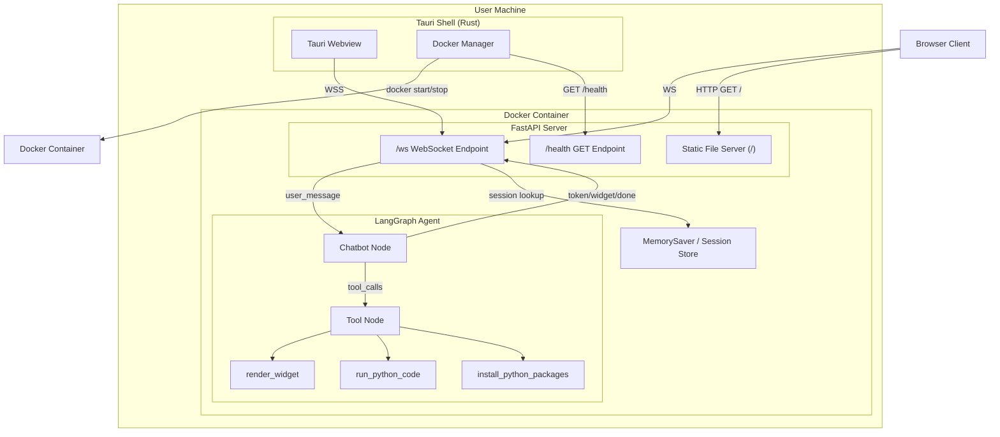
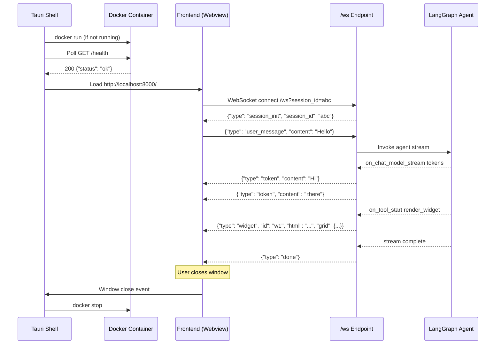

# Design Document: Tauri + Docker + WSS Architecture

## Overview

This design migrates the Astra PoC from a plain FastAPI+SSE web app into a Tauri desktop application backed by a Dockerized agent backend communicating over WebSockets. The key changes are:

1. **Replace SSE+POST with WebSocket** — A single `/ws` endpoint replaces the current `POST /chat` + SSE streaming pattern, enabling true bidirectional communication.
2. **Dockerize the backend** — The FastAPI + LangGraph agent runs inside a Docker container, isolating `run_python_code` execution from the host and making the backend portable.
3. **Wrap in Tauri** — A lightweight Tauri shell provides a native desktop window, manages the Docker container lifecycle (start/stop), and loads the frontend from the container's HTTP server.
4. **Browser fallback** — The same container serves static files so the app works in a plain browser without Tauri.

The existing frontend (HTML/JS with GridStack canvas, iframe widget rendering) is preserved with minimal changes — only the communication layer in `app.js` is rewritten from SSE parsing to WebSocket message handling.

### Design Decisions

| Decision | Rationale |
|---|---|
| Single `/ws` endpoint (no REST for chat) | Eliminates the SSE+POST split; simpler client code, lower latency, native bidirectional flow |
| Tauri loads from container URL (not bundled files) | Single source of truth for frontend; browser and Tauri always serve identical code |
| `websockets` via FastAPI's built-in WebSocket support | No extra dependency; FastAPI's Starlette WebSocket is production-ready |
| Session ID via query parameter on WS connect | Stateless reconnection; no cookies or auth headers needed for PoC |
| Docker `--no-new-privileges` + non-root user | Defense-in-depth for `run_python_code` without needing gVisor/Firecracker complexity at PoC stage |

## Architecture

### System Diagram



### Connection Flow



## Components and Interfaces

### 1. WebSocket Server (`main.py` — modified)

Replaces the current `POST /chat` SSE endpoint with a WebSocket handler.

**Interface:**
```python
# FastAPI WebSocket endpoint
@app.websocket("/ws")
async def websocket_endpoint(websocket: WebSocket, session_id: str | None = None):
    """
    Accepts a WebSocket connection. Reads JSON messages from the client,
    dispatches to the LangGraph agent, and streams responses back.
    """
    ...
```

**Responsibilities:**
- Accept WebSocket connections on `/ws`
- Parse `session_id` from query params (or generate a new UUID)
- Send `session_init` message on connect
- Route incoming `user_message` to `get_agent_response_stream()`
- Route incoming `widget_event` to agent as a HumanMessage with event context
- Stream `token`, `widget`, `done`, `error` messages back
- Handle malformed JSON gracefully (send `error`, keep connection open)
- Catch unhandled exceptions during agent processing (send `error`, keep connection open)

### 2. Health Check Endpoint (`main.py` — new route)

```python
@app.get("/health")
async def health_check():
    """Returns 200 when the server is ready, 503 while initializing."""
    ...
```

A simple readiness probe. Returns `{"status": "ok"}` with HTTP 200 once the FastAPI app and LangGraph graph are initialized. Returns 503 during startup.

### 3. Frontend WebSocket Client (`app.js` — rewritten communication layer)

**Interface:**
```javascript
// WebSocket connection manager
class AgentConnection {
    constructor(url)          // Connect to ws://host/ws?session_id=...
    send(message)             // Send typed JSON message
    onToken(callback)         // Register token handler
    onWidget(callback)        // Register widget handler
    onDone(callback)          // Register done handler
    onError(callback)         // Register error handler
    onSessionInit(callback)   // Register session init handler
    reconnect()               // Reconnect with exponential backoff
    close()                   // Clean close
}
```

**Changes from current `app.js`:**
- Remove `fetch('/chat', ...)` POST logic and SSE reader
- Replace with `AgentConnection` that opens a WebSocket to `/ws`
- `sendMessage()` sends `{"type": "user_message", "content": "..."}` over WS
- `dispatchAgentEvent()` sends `{"type": "widget_event", "event_name": "...", "payload": {...}}` over WS
- Message dispatch: `token` → append to chat, `widget` → `renderGenUIComponent()`, `done` → finalize, `error` → show system message
- Reconnection: exponential backoff (1s, 2s, 4s, 8s, 16s), max 5 retries
- WebSocket URL derived from `window.location` (works for both Tauri and browser)

### 4. Docker Container

**Dockerfile:**
```dockerfile
FROM python:3.12-slim

RUN useradd -m -s /bin/bash agent
WORKDIR /app

COPY requirements.txt .
RUN pip install --no-cache-dir -r requirements.txt

COPY . .

USER agent
EXPOSE 8000

CMD ["uvicorn", "main:app", "--host", "0.0.0.0", "--port", "8000"]
```

**Key properties:**
- Non-root user (`agent`)
- Single exposed port (8000)
- Env vars: `OPENAI_API_KEY`, `OPENAI_MODEL` passed at `docker run`
- Run with `--no-new-privileges --cap-drop=ALL` flags

### 5. Tauri Desktop Shell

**Structure:**
```
tauri-app/
├── src-tauri/
│   ├── src/
│   │   └── main.rs          # Docker lifecycle + window management
│   ├── Cargo.toml
│   └── tauri.conf.json
```

**Rust-side responsibilities (`main.rs`):**
- On app start: check if container is running (`docker ps`), start if not (`docker run`)
- Poll `GET /health` until 200 (timeout after 60s → show error dialog)
- Load webview URL: `http://localhost:{port}/`
- On window close: `docker stop {container_name}`
- Port configurable via Tauri settings/config file

**Tauri config (`tauri.conf.json`):**
- No bundled frontend files (loads from external URL)
- Window title: "Astra"
- Default size: 1400×900
- Allow external URL navigation to `localhost:{port}`

### 6. Agent Backend (`agent.py` — modified)

**Changes:**
- `run_python_code`: Add 30-second timeout using `asyncio.wait_for` or `signal.alarm`
- `run_python_code`: Runs inside Docker already, so host filesystem isolation is inherent
- No changes to `render_widget` or `install_python_packages` tools
- No changes to LangGraph graph structure

### 7. Session Manager

**Interface:**
```python
class SessionManager:
    def get_or_create(self, session_id: str | None) -> str:
        """Returns existing session_id or generates a new UUID."""
        ...

    def get_config(self, session_id: str) -> dict:
        """Returns LangGraph config dict for this session."""
        return {"configurable": {"thread_id": session_id}}
```

Thin wrapper around the existing `MemorySaver` checkpointer. The LangGraph `thread_id` maps directly to `session_id`. No additional persistence layer needed — `MemorySaver` already handles conversation state.

## Data Models

### Message Protocol (TypedDict / JSON Schema)

All messages are JSON objects with a required `type` field.

#### Server → Client Messages

```python
from typing import TypedDict, Literal

class TokenMessage(TypedDict):
    type: Literal["token"]
    content: str                    # Streamed text chunk

class WidgetMessage(TypedDict):
    type: Literal["widget"]
    id: str                         # Widget identifier
    html: str                       # HTML content for iframe
    grid: GridOptions               # Positioning/sizing

class GridOptions(TypedDict, total=False):
    w: int                          # Grid columns (1-12)
    h: int                          # Grid rows (height in 10px cells)
    x: int                          # Column position
    y: int                          # Row position

class DoneMessage(TypedDict):
    type: Literal["done"]

class ErrorMessage(TypedDict):
    type: Literal["error"]
    content: str                    # Error description

class SessionInitMessage(TypedDict):
    type: Literal["session_init"]
    session_id: str                 # Assigned session identifier
```

#### Client → Server Messages

```python
class UserMessage(TypedDict):
    type: Literal["user_message"]
    content: str                    # User's chat text

class WidgetEventMessage(TypedDict):
    type: Literal["widget_event"]
    event_name: str                 # Event identifier from widget
    payload: dict                   # Arbitrary event data
```

#### Discriminated Union

```python
from typing import Union

ServerMessage = Union[TokenMessage, WidgetMessage, DoneMessage, ErrorMessage, SessionInitMessage]
ClientMessage = Union[UserMessage, WidgetEventMessage]
```

### Health Check Response

```python
class HealthResponse(TypedDict):
    status: Literal["ok"]
```

### Session State

No new persistent data model. Sessions map to LangGraph's existing `MemorySaver` via `thread_id`. The `session_id` is a UUID string passed as a query parameter on WebSocket connect.

```
session_id (UUID string) → LangGraph config {"configurable": {"thread_id": session_id}}
```


## Correctness Properties

*A property is a characteristic or behavior that should hold true across all valid executions of a system — essentially, a formal statement about what the system should do. Properties serve as the bridge between human-readable specifications and machine-verifiable correctness guarantees.*

### Property 1: Message protocol round-trip

*For any* valid `ServerMessage` or `ClientMessage` object, serializing it to JSON and deserializing it back should produce an object with all required fields preserved — including `type`, and the type-specific fields (`content` for token/user_message/error, `id`/`html`/`grid` for widget, `event_name`/`payload` for widget_event, `session_id` for session_init).

**Validates: Requirements 2.3, 2.4, 2.5, 2.6, 2.7**

### Property 2: Agent token event maps to correct token message

*For any* text string emitted by the LangGraph agent via `on_chat_model_stream`, the WebSocket server should produce a JSON message with `type` equal to `"token"` and `content` equal to the emitted text string.

**Validates: Requirements 1.4, 2.3**

### Property 3: Agent widget event maps to correct widget message

*For any* `render_widget` tool invocation with arbitrary `id`, `html`, `width_percent`, and `height_px` values, the WebSocket server should produce a JSON message with `type` equal to `"widget"` and containing the correct `id`, `html`, and computed `grid` dimensions (w = clamp(width_percent * 12 / 100, 1, 12), h = max(1, height_px / 10)).

**Validates: Requirements 1.5, 2.4**

### Property 4: Stream always terminates with done message

*For any* completed agent invocation (regardless of whether it produced tokens, widgets, or errors), the last message sent over the WebSocket for that invocation should have `type` equal to `"done"`.

**Validates: Requirements 1.6**

### Property 5: Malformed JSON produces error without closing connection

*For any* string that is not valid JSON, sending it over the WebSocket should result in a response message with `type` equal to `"error"` and a non-empty `content` field, and the WebSocket connection should remain in the OPEN state afterward.

**Validates: Requirements 1.7**

### Property 6: Frontend dispatches messages to correct handlers by type

*For any* server message, the frontend should route `token` messages to the chat append handler, `widget` messages to `renderGenUIComponent`, `error` messages to the system message display, and `done` messages to the input re-enable handler. The dispatch is determined solely by the `type` field.

**Validates: Requirements 3.3, 3.4, 3.5, 3.6**

### Property 7: Reconnection follows exponential backoff with max 5 retries

*For any* sequence of WebSocket disconnections, the reconnection delays should follow the pattern 1s, 2s, 4s, 8s, 16s (doubling each time), and no more than 5 reconnection attempts should be made before giving up.

**Validates: Requirements 3.7**

### Property 8: Widget event bridge produces correct WebSocket message

*For any* `event_name` string and `payload` object dispatched via `dispatchAgentEvent`, the frontend should send a WebSocket message with `type` equal to `"widget_event"`, `event_name` matching the dispatched name, and `payload` matching the dispatched payload.

**Validates: Requirements 3.8**

### Property 9: WebSocket URL derived correctly from page origin

*For any* page origin, if the protocol is `https:` the derived WebSocket URL should use `wss://`, and if the protocol is `http:` it should use `ws://`. The host and port should be preserved from the origin.

**Validates: Requirements 5.3**

### Property 10: Session resume via session_id

*For any* session that was previously created, closing the WebSocket connection and reconnecting with the same `session_id` query parameter should resume the same LangGraph conversation thread (the agent should have access to prior message history).

**Validates: Requirements 8.3**

### Property 11: New unique session_id generated when none provided

*For any* set of WebSocket connections established without a `session_id` query parameter, each connection should receive a `session_init` message containing a unique `session_id` string, and no two connections should receive the same `session_id`.

**Validates: Requirements 8.4**

### Property 12: Code execution stdout capture round-trip

*For any* Python code string that calls `print()` with a known value, invoking `run_python_code` with that code should return a result string containing the printed value.

**Validates: Requirements 9.2**

### Property 13: Exception-raising code returns error without crashing

*For any* Python code string that raises an exception, invoking `run_python_code` should return a result string containing the exception message, and the Agent_Backend should remain operational (able to process subsequent requests).

**Validates: Requirements 9.3**

### Property 14: Valid client messages are parsed and routed to agent

*For any* valid `user_message` JSON object with a non-empty `content` field, sending it over the WebSocket should result in the LangGraph agent being invoked with that content as a `HumanMessage`.

**Validates: Requirements 1.2**

## Error Handling

### WebSocket Server Errors

| Error Scenario | Handling |
|---|---|
| Malformed JSON from client | Send `{"type": "error", "content": "Invalid JSON: ..."}`, keep connection open |
| Unknown message type from client | Send `{"type": "error", "content": "Unknown message type: ..."}`, keep connection open |
| Agent raises unhandled exception | Send `{"type": "error", "content": "Agent error: ..."}`, send `{"type": "done"}`, keep connection open |
| WebSocket connection drops mid-stream | Server cleans up agent task; client reconnects via exponential backoff |
| `run_python_code` timeout (>30s) | Kill execution, return timeout error as tool result, agent continues |
| `run_python_code` exception | Capture exception string, return as tool result, agent continues |

### Frontend Errors

| Error Scenario | Handling |
|---|---|
| WebSocket connection refused | Retry with exponential backoff (1s, 2s, 4s, 8s, 16s), max 5 attempts |
| All reconnection attempts exhausted | Display "Connection lost" system message, disable input |
| Unparseable server message | Log to console, skip message, continue listening |
| Widget render failure | Log error, display fallback error in widget area |

### Tauri Shell Errors

| Error Scenario | Handling |
|---|---|
| Docker not installed | Show error dialog: "Docker is required but not found" |
| Container fails to start within 60s | Show error dialog with failure reason from Docker logs |
| Container crashes during use | Detect via health check failure, show reconnection dialog |
| Port already in use | Show error dialog suggesting port change via settings |

## Testing Strategy

### Dual Testing Approach

This feature requires both unit tests and property-based tests for comprehensive coverage.

**Unit tests** cover:
- Specific examples (e.g., health endpoint returns `{"status": "ok"}`)
- Integration points (e.g., Tauri starts Docker, polls health, loads URL)
- Edge cases (e.g., 30-second timeout on code execution, malformed JSON handling)
- Docker configuration (e.g., non-root user, exposed port)

**Property-based tests** cover:
- Universal properties that hold for all inputs (Properties 1–14 above)
- Comprehensive input coverage through randomized generation

### Property-Based Testing Configuration

- **Python backend**: Use `hypothesis` library
- **JavaScript frontend**: Use `fast-check` library
- **Minimum iterations**: 100 per property test
- **Each test must be tagged** with: `Feature: tauri-docker-wss-architecture, Property {number}: {property_text}`
- **Each correctness property must be implemented by a single property-based test**

### Test Breakdown

#### Backend (Python + Hypothesis)

| Test Type | What | Properties |
|---|---|---|
| Property | Message protocol serialization round-trip | Property 1 |
| Property | Token event → token message mapping | Property 2 |
| Property | Widget event → widget message mapping (grid computation) | Property 3 |
| Property | Stream termination with done message | Property 4 |
| Property | Malformed JSON → error, connection open | Property 5 |
| Property | Session ID uniqueness on new connections | Property 11 |
| Property | stdout capture round-trip | Property 12 |
| Property | Exception code → error result, server alive | Property 13 |
| Property | Valid messages parsed and routed | Property 14 |
| Unit | Health endpoint returns 200 with correct body | Req 7.2 |
| Unit | Health endpoint returns 503 during init | Req 7.3 |
| Unit | Session resume with same session_id | Property 10 |
| Unit | Static files served at `/` | Req 5.1 |
| Unit | Code execution 30s timeout | Req 9.4, 9.5 |

#### Frontend (JavaScript + fast-check)

| Test Type | What | Properties |
|---|---|---|
| Property | Message dispatch routes by type | Property 6 |
| Property | Reconnection exponential backoff timing | Property 7 |
| Property | Widget event bridge message format | Property 8 |
| Property | WS URL derivation from origin | Property 9 |
| Unit | WebSocket connects to /ws on load | Req 3.1 |
| Unit | Done message re-enables input | Req 3.5 |
| Unit | User message sends correct format | Req 3.2 |

#### Integration / E2E

| Test Type | What |
|---|---|
| Integration | Full message flow: connect → send user_message → receive tokens → receive done |
| Integration | Widget rendering: send user_message → receive widget → verify GridStack widget created |
| Integration | Session persistence: connect → send messages → disconnect → reconnect with session_id → verify context |
| E2E | Docker container builds and starts within 30s |
| E2E | Tauri launches, starts Docker, loads frontend |
